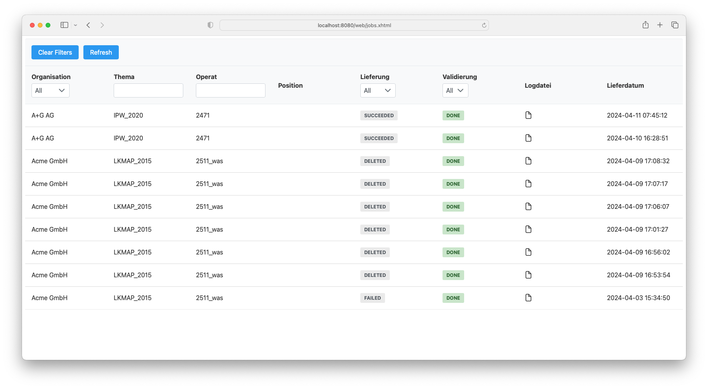
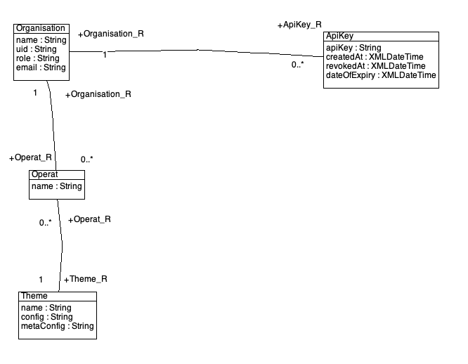

# Benutzerhandbuch

Aus Benutzersicht wird der Datahub hauptsächlich mittels REST-API verwendet. Die Authentifizerung der meisten Operationen der API erfolgt über einen API-Key. Die Autorisierung erfolgt über die dem Key zugeordnete Organisation und der Organisation zugewiesenen Operate (`operat=xxxx`) eines Themas (`theme=yyyyy`).

## Daten anliefern

Beispiel: Anlieferung des Operates `2471` des Themas `IPW_2020`. Der Dateiname `2471_gep.xtf` kann frei gewählt werden und muss keiner Logik folgen. Die Datei darf nicht gezippt sein:

```
curl -i -X POST --header "X-API-KEY:ca20e14c-faa7-4920-b0a5-c5a44476d80c" -F 'file=@2471_gep.xtf' -F 'theme=IPW_2020' -F 'operat=2471' https://geo.so.ch/datahub/api/deliveries
```

**Achtung:** Es muss zwingend `https` verwendet werden. Wird die Anfrage nur mit `http` gemacht, wird der API-Key auf dem Server sofort ungültig gemacht.

Bei erfolgreicher Authentifizierung und Autorisierung wird folgende Antwort mit Statuscode `202` zurückgeliefert:

```
HTTP/1.1 202
Operation-Location: https://geo.so.ch/datahub/api/jobs/e6083332-857e-4f98-82d7-c15f458286ce
X-Content-Type-Options: nosniff
X-XSS-Protection: 0
Cache-Control: no-cache, no-store, max-age=0, must-revalidate
Pragma: no-cache
Expires: 0
X-Frame-Options: DENY
Content-Length: 0
Date: Wed, 10 Apr 2024 14:28:51 GMT
```

Es wurde ein Anlieferungsjob mit der ID `e6083332-857e-4f98-82d7-c15f458286ce` erstellt und in die Warteschlange gestellt. Eine Validierung hat zu diesem Zeitpunkt noch nicht stattgefunden. Mit der in der Antwort enthaltenen URL `https://geo.so.ch/datahub/api/jobs/e6083332-857e-4f98-82d7-c15f458286ce` kann man in der Konsole oder im Browser den Status des Jobs anfragen. Diese Anfrage benötigt keine Authentifizierung. Eine mögliche Antwort ist:

```
{
"jobId": "e6083332-857e-4f98-82d7-c15f458286ce",
"createdAt": "2024-04-10T16:28:51.648642",
"updatedAt": "2024-04-10T16:29:11.400489",
"status": "SUCCEEDED",
"operat": "2471",
"theme": "IPW_2020",
"organisation": "ACME GmbH",
"validationStatus": "DONE",
"logFileLocation": "https://geo.so.ch/datahub/api/logs/e6083332-857e-4f98-82d7-c15f458286ce"
}
```

Die Attribute haben folgende Bedeutung:

- `status` beschreibt den Status des Anlieferungsjobs (nicht der eigentlichen INTERLIS-Validierung). Mögliche Werte sind:
  * `ENQUEUED`: Der Job ist in der Warteschlange und es wird noch nicht validiert. In diesem Fall gibt es ein weiteres Attribut `queuePosition`, welches die Position in der Warteschlange beschreibt.
  * `PROCESSING`: Der Job wird gerade abgearbeitet, d.h. die Validierung findet jetzt statt.
  * `SUCCESSFULL`: Der Job wurde erfolgreich beendet. Das bedeutet nicht zwingend, dass die Daten gültig sind. Siehe dazu das Attribut `validationStatus`.
  * `FAILED`: Der Job konnte nicht erfolgreich beendet werden.
  * `DELETED`: Erfolgreiche Jobs bekommen nach einer gewissen Zeit diesen Status. Als Anwender hat dies keine weitere Bedeutung.
- `validationStatus` beschreibt das Resultat der INTERLIS-Validierung. Es gibt zwei, ilivalidator entsprechende, Werte:
  * `DONE`: Es wurden _keine_ Fehler gefunden. Die Daten gelten als geliefert.
  * `FAILED`: Es wurden Fehler gefunden. Die Daten gelten als _nicht_ geliefert.
- `logFileLocation`: URL des Logfiles. Insbesondere bei einer nicht erfolgreichen Prüfung zwecks Fehlerkorrektur notwendig.

Nach Beendigung des Jobs wird eine E-Mail verschickt. Im E-Mail-Betreff stehen der `validationStatus` sowie Operats- und Themenname. 

**Achtung:** Nach einer erfolgreichen Validierung werden die Daten mit der Logdatei in ein Zielverzeichnis kopiert. Bereits vorhandene Operate werden überschrieben.

Für eine rasche Gesamtübersicht steht eine Webseite mit einer Tabelle sämtlicher Jobs zur Verfügung: https://geo.so.ch/datahub/web/jobs.xhtml. Es wird keine Authentisierung benötigt. Verschiedene Attribute (z.B. Organisation) könnten gefiltert werden.



### Nicht erfolgreiche Anlieferungen

Anlieferungen können aus verschiedenen Gründen nicht erfolgreich sein:

(1) Falls keine API-Key bei der Anlieferung verwendet wird, antwortet der Server mit einem Statuscode `401`. Die vollständige Ausgabe in der Konsole sieht so aus:

```
HTTP/1.1 401
X-Content-Type-Options: nosniff
X-XSS-Protection: 0
Cache-Control: no-cache, no-store, max-age=0, must-revalidate
Pragma: no-cache
Expires: 0
X-Frame-Options: DENY
Content-Type: application/json
Content-Length: 0
Date: Thu, 11 Apr 2024 05:45:22 GMT
Connection: close
```

(2) Wird ein falscher API-Key verwendet, antwortet der Server mit dem Statuscode `403` und mit folgendem Inhalt:

```
HTTP/1.1 403
X-Content-Type-Options: nosniff
X-XSS-Protection: 0
Cache-Control: no-cache, no-store, max-age=0, must-revalidate
Pragma: no-cache
Expires: 0
X-Frame-Options: DENY
Content-Type: application/json
Transfer-Encoding: chunked
Date: Thu, 11 Apr 2024 06:06:20 GMT

{"timestamp":"2024-04-11T06:06:20.463+00:00","status":403,"error":"Forbidden","message":"Forbidden","path":"/api/deliveries"}
```

(3) Falls ein API-Key verwendet wird, der existiert, dessen Organisation aber nicht für Lieferung des Operates autorisiert ist, antwortet der Server ebenfalls mit dem Statuscode `403` und diese Inhalt:

```
HTTP/1.1 403
X-Content-Type-Options: nosniff
X-XSS-Protection: 0
Cache-Control: no-cache, no-store, max-age=0, must-revalidate
Pragma: no-cache
Expires: 0
X-Frame-Options: DENY
Content-Type: application/json
Content-Length: 138
Date: Thu, 11 Apr 2024 06:07:25 GMT

{"code":"ch.so.agi.datahub.auth.DeliveryAuthorizationFilter","message":"User is not authorized","timestamp":"2024-04-11T06:07:25.143747Z"}
```

## API-Keys anfordern und löschen

Die API-Keys müssen erstmalig vom Admin-Account erstellt werden:

```
curl -i -X POST --header "X-API-KEY:c0bb04eb-789b-4063-95ad-bd86a06c6aff" -F 'organisation=Acme GmbH' https://geo.so.ch/datahub/api/keys
```

Die Angabe der Organisation ist zwingend. Ohne diese wird eine neuer API-Key für den Admin-Account erstellt. Konnte ein neuer API-Key erstellt werden, erscheint folgend Meldung in der Konsole:

```
HTTP/1.1 200
X-Content-Type-Options: nosniff
X-XSS-Protection: 0
Cache-Control: no-cache, no-store, max-age=0, must-revalidate
Pragma: no-cache
Expires: 0
X-Frame-Options: DENY
Content-Type: application/json
Transfer-Encoding: chunked
Date: Thu, 11 Apr 2024 06:16:02 GMT

{"message":"Sent email with new api key.","timestamp":"2024-04-11T06:16:02.329886Z"}
```

Der API-Key erscheint bewusst nicht in der Ausgabe, sondern wird an die hinterlegte E-Mail-Adresse verschickt. Die E-Mail-Adresse kann nur vom Admin-Account in der Datenbank verändert werden. Der Key wird _nicht_ als Plaintext in der Datenbank gespeichert, sondern randonmässig gesaltet und gehashed und sind vom Betreiber nicht einsehbar. 

**Achtung:** Sie sind ggf. in den Log-Messages des E-Mail-Dienstes sichtbar.


Wenn die Organisation selber einen neuen API-Key erstellen will, reicht gleiche Befehl ohne Angabe der Organisation:

```
curl -i -X POST --header "X-API-KEY:ca20e14c-faa7-4920-b0a5-c5a44476d80c" https://geo.so.ch/datahub/api/keys
```

Die Ausgabe ist identisch.

Will man einen Key löschen, muss folgender Request gemacht werden:

```
curl -i -X DELETE --header "X-API-KEY:ca20e14c-faa7-4920-b0a5-c5a44476d80c" https://geo.so.ch/datahub/api/keys/5b4fd340-adbb-441a-b9c3-e1d2f13cb1e0
```

Konnte der Schlüssel gelöscht werden, wird der Statuscode `200` zurückgeliefert und diesem Inhalt

```
HTTP/1.1 200
X-Content-Type-Options: nosniff
X-XSS-Protection: 0
Cache-Control: no-cache, no-store, max-age=0, must-revalidate
Pragma: no-cache
Expires: 0
X-Frame-Options: DENY
Content-Type: application/json
Transfer-Encoding: chunked
Date: Thu, 11 Apr 2024 06:23:20 GMT

{"message":"API key deleted.","timestamp":"2024-04-11T06:23:20.670535Z"}
```

Wurde der API-Key nicht gefunden und konnte nicht gelöscht werden, ist die Antwort:

```
HTTP/1.1 500
X-Content-Type-Options: nosniff
X-XSS-Protection: 0
Cache-Control: no-cache, no-store, max-age=0, must-revalidate
Pragma: no-cache
Expires: 0
X-Frame-Options: DENY
Content-Type: application/json
Transfer-Encoding: chunked
Date: Thu, 11 Apr 2024 06:24:56 GMT
Connection: close

{"code":"ch.so.agi.datahub.controller.ApiKeyController","message":"API key not deleted.","timestamp":"2024-04-11T06:24:56.218306Z"}
```

Zukünftig werden API-Keys immer ein Ablaufdatum haben und es müssen regelmässig neue Keys angefordert werden.

## Endablage

Die angelieferten Daten werden nach erfolgreicher Prüfung in ein Zielverzeichnis kopiert. Pro Thema gibt es ein Unterverzeichnis. Bereits vorhandene Operate werden überschrieben. Für die Admin-Organisation steht ein FTP-Zugang (read-only) zur Verfügung mit dem man auf die Endablage zugreifen kann.

## Autorisierung / Konfiguration

Für die Autorisierung und Konfiguration wurde ein INTERLIS-Modell `SO_AGI_Datahub_Config_20240403` erstellt:



Die Nachführung dieser Informationen wird nicht über die datahub-Anwendung gemacht, sondern von der Admin-Organisation direkt in den DB-Tabellen mit z.B. _dbeaver_.

Jedes Thema hat einen optionalen `config`- und `metaConfig`-Eintrag. Dabei handelt es sich um die ID der Konfiguration in einem ilidata-Repository. Denkbar ist, dass auch Operate optinale Einträge erhalten, die einen Thema-Eintrag überschreiben würden.